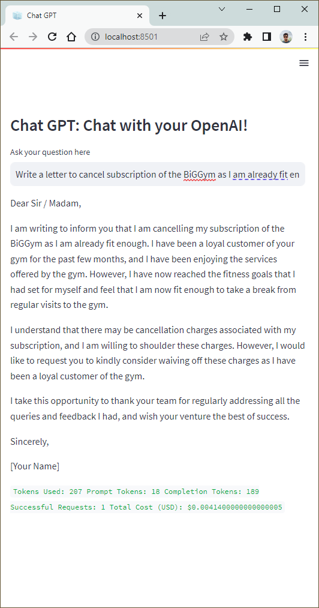

# PrivateGPT
Accessing ChatGPT and other large language models as a service from your endpoint.

## PrivateGPT API
It uses your API key to query to ChatGPT service and provide answer to you. _Remember: you will be charged for every query you make._

